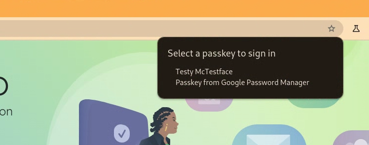

# Explainer: WebAuthn Ambient UI

## Author:

Ken Buchanan \<kenrb@chromium.org\>

_Last updated: 10-Sep-2024_

## Summary

This explainer describes an augmentation to [WebAuthn Conditional Mediation](https://github.com/w3c/webauthn/wiki/Explainer:-WebAuthn-Conditional-UI) that allows a Relying Party (RP) to trigger a WebAuthn sign-in flow when eligible discoverable credentials are available without a login form being present on the page. We are calling this enhancement Ambient UI.

User agents would display the credentials to the user on an unobtrusive UI surface such as a bubble. Optionally, they can integrate other [Credential Management API](https://www.w3.org/TR/credential-management-1/) credential types such as passwords into the same surface.

## Background

Conditional mediation allows WebAuthn to be integrated into the form autofill feature available on modern browsers. This allows RPs to provide WebAuthn-based sign-in on login pages that currently have username and passwords fields while avoiding modal WebAuthn dialogs for users who don’t have eligible credentials.

The motivation for this feature is to improve the sign-in experience when a user navigates to an arbitrary page on a site where the user has an existing account, but not an active signed-in session.

A typical use case would be a paywalled news article that the user arrived at via a link on social media, where the user has an account on the site hosting the article. Sites commonly provide a link to a sign-in page or dialog with various account sign-in options. A WebAuthn conditional mediation call with this feature enabled would allow a lightweight UI surface to appear containing eligible credentials. If the user selects one, the flow proceeds as it does now for an autofill-based WebAuthn credential selection. This can enable a sign-in without disruptions such as page navigation.

For a user with no eligible credentials for the site, no UI would be shown. In this case, the request promise will not resolve, so that the site doesn’t gain any information about whether the user has credentials.



## API

This proposes a new field be added to [PublicKeyCredentialRequestOptions](https://www.w3.org/TR/webauthn-3/#dictdef-publickeycredentialcreationoptions). The field is called `display`, and initially has two values: `autofill` and `ambient`. When unspecified, its default value is used, which is `autofill`.

Setting the display field in a request that does not specify conditional mediation results in an error.

Feature detection is provided by another enumeration value in ClientCapability: `ambientConditionalMediation`.

When the request contains `mediation: "conditional"` and the PublicKeyCredentialRequestOptions contains `display: "autofill"`, the user agent displays discoverable WebAuthn credentials in a correspondingly-tagged input form control. This is the existing behavior for user agents that implement conditional mediation.

When the request contains `mediation: "conditional"` and the PublicKeyCredentialRequestOptions contains `display: "ambient"`, the user agent displays discoverable WebAuthn credentials immediately on an unobtrusive UI prompt.

If the site wants to have the Ambient UI prompt and also has a sign-in form on that page, the autofill behavior still works. That is, on a request with display: ‘ambient’ if the user dismisses or ignores that UI but then clicks on a webauthn-tagged input field, the autofill UI will show the same as for a display: ‘autofill’ request.

Example:
```javascript
const cred = await navigator.credentials.get({
  mediation: 'conditional',
  publicKey: {
    challenge: ...,
    rpId: 'example.com',
    allowCredentials: {...},
    display: 'ambient',
  },
  password: true,
});
```

## Other Credential Types

Requests for other credential types, such as [PasswordCredential](https://www.w3.org/TR/credential-management-1/#passwordcredential) or [FederatedCredential](https://www.w3.org/TR/credential-management-1/#federatedcredential), can already trigger immediate user agent UI. User agents can choose to simultaneously display those alongside WebAuthn credentials without any change to the Credential Management specification.
