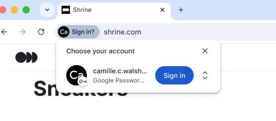

# Explainer: Conditional UI without Autofill

## Author:

Ken Buchanan \<kenrb@chromium.org\>

_Last updated: 24-Sep-2026_

## Summary

This explainer describes an augmentation to [WebAuthn Conditional Mediation](https://github.com/w3c/webauthn/blob/main/explainers/conditional-ui.md) that allows a Relying Party (RP) to trigger a WebAuthn sign-in flow when eligible discoverable credentials are available without a login form being present on the page.

User agents display the credentials to the user in a dedicated UI surface. Optionally, they can integrate other [Credential Management API](https://www.w3.org/TR/credential-management-1/) credential types such as passwords or [FedCM](https://www.w3.org/TR/fedcm/) into the same surface.

## Background and Use Cases

Conditional mediation allows WebAuthn to be integrated into the form autofill feature available on modern browsers. This allows RPs to provide WebAuthn-based sign-in on login pages that currently have username and passwords fields while avoiding modal WebAuthn dialogs for users who don’t have eligible credentials.

The motivation for this feature is to improve the sign-in experience when a user navigates to an arbitrary page on a site where the user has an existing account, but not an active signed-in session. Conditional UI is not useable because there is not a sign-in form on the page. Prompting a passkey sign-in with a modal dialog is undesirable because the it is an obstruction if the user does not have a passkey for the site.

This differs from [Immediate Mode](https://github.com/w3c/webauthn/blob/main/explainers/immediate-mediation.md) in that the returned promise does not resolve if there are no credentials available, and also in that it does not require a user activation. This mode is therefore suitable to be activated on page load without the user having interacted with the page.

Examples:
* A user on a social media site clicks a link to a paywalled news article. The user has an account on the site hosting the article but not a valid signed-in session. The user sees and clicks a browser sign-in prompt and it completes a sign-in to unlock the page.
* A user uses a search engine to search for a category of product and then clicks a link to an e-commerce site where they have an account. The user is not signed in so the page shows generalized results. When the user signs in using the prompt, the results page changes to show more relevant products based on the history of previous purchases the user has made.

For a user with no eligible credentials for the site, no UI is shown. In this case, the returned Promise does not resolve, the same as is currently the case in Conditional UI.



## API

Feature detection is provided by another enumeration value in ClientCapability: `conditionalPassive`.

When the request contains `mediation: "conditional"` and the PublicKeyCredentialRequestOptions contains `uiMode: "passive"`, the user agent displays discoverable WebAuthn credentials immediately in an unobtrusive UI prompt.

If the site wants to offer the non-autofill Conditional UI prompt and also has a sign-in form on that page, the autofill behavior still works. That is, on a request with `uiMode: ‘passive’` if the user dismisses or ignores that UI but then clicks on a webauthn-tagged input field, the autofill UI will show the same as for any other `mediation: 'conditional'` request. Clicking a credential in the autofill UI behaves the same as clicking the same credential in the non-autofill UI.

Example:
```javascript
const cred = await navigator.credentials.get({
  mediation: 'conditional',
  uiMode: 'passive',
  publicKey: {
    challenge: ...,
    rpId: 'example.com',
    allowCredentials: {...},
  },
  password: true,
});
```

## Other Credential Types

Non-autofill Conditional UI behaves similarly to [Federated Credential Management passive mode](https://w3c-fedid.github.io/FedCM/#dom-identitycredentialrequestoptionsmode-passive). Browsers that support both can offer them in integrated UI.

Requests for other credential types, such as [PasswordCredential](https://www.w3.org/TR/credential-management-1/#passwordcredential) can similarly be integrated into UI.

## Alternatives Considered

### No web platform change

User agents already have the ability to provide credentials in a dedicated non-autofill UI in response to a request with `mediation: "conditional"`. Since Conditional UI is an established and widely used feature, we are concerned it would be unwelcome and disruptive to change the way it works in browser UI for all RPs. Adding a new `uiMode` value enables RPs to opt in the alternative UI. 
