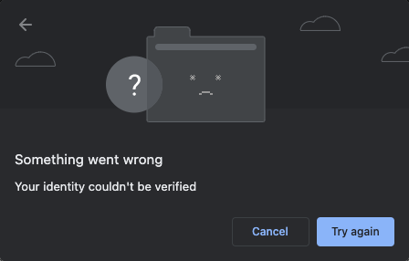
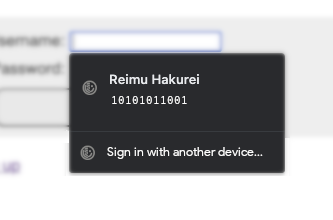

# Explainer: WebAuthn Conditional UI

## Authors:

Nina Satragno \<nsatragno@chromium.org\>

Jeff Hodges \<jdhodges@chromium.org\>

_Last updated: 05-Oct-2022_

## Summary

A new mode for [WebAuthn](https://w3c.github.io/webauthn/) that displays a credential selection UI only if the user has a [discoverable credential](#discoverable-credential) registered with the [Relying Party](#relying-party) on their authenticator. The credential is displayed alongside autofilled passwords. This solves the bootstrapping problem when replacing traditional username and password with WebAuthn: websites can fire a WebAuthn call while showing a regular password prompt without worrying about showing a modal dialog error if the device lacks appropriate credentials.

This feature is part of an [overarching push to broaden the user-base of WebAuthn](https://github.com/w3c/webauthn/wiki/Explainer:-broadening-the-user-base-of-WebAuthn).

## Background

WebAuthn is a complex authentication API that allows users to log-in to websites using pieces of hardware known as authenticators. Authenticators can either be built-into a platform (such as a fingerprint reader on a laptop) or roaming (such as a USB security key). 
WebAuthn satisfies two use cases:

* Using a hardware device as a second factor (in addition to passwords)
* Using a hardware device as a single factor, (replacing passwords).
  
  _Note:  This is known as "passwordless" when the user is required to input their username in addition to the password, or "usernameless" when neither are required. For the latter case, a relying party must register a discoverable credential, which chrome always protects with either a PIN or fingerprint. This means even in the "just use WebAuthn" case, "single factor" is a historical misnomer: the user still needs to input a PIN or fingerprint in addition to proving they have possession of the authenticator._

The first use case is essentially solved and we've seen good buy in from the ecosystem. However, there are virtually no implementations for the second use case. This is despite WebAuthn being phishing resistant and arguably a better user experience than typing a password or using a password manager. Why?

[WebAuthn is designed to make it impossible to query for credential availability](https://w3c.github.io/webauthn/#sctn-assertion-privacy) without going through a complete, modal dialog heavy, authentication flow. If a website doesn't know whether a registered authenticator is available on the device the user is attempting to log-in with, what should it do? Relying parties don't want to fire a WebAuthn request if there's a good chance the user doesn't have credentials available on that device because it will fail right away, and disrupt the user's task flow:



_Dialog shown when there are no Touch ID credentials on the device_

They could add a button to their page that triggers WebAuthn, but this puts the onus on (and potentially confuses) the user. We have heard from partners that it's very hard to find wording for such a button, since in the best case, the user knows their platform authenticator by its platform-specific name such as Touch ID or Windows Hello -- users don't know (and shouldn't have to know) about the cross-platform term "WebAuthn".

## Requirements

To solve the single-factor case while allowing transition from passwords, we want a solution that satisfies the following requirements:

1. Keep preserving user privacy by not disclosing whether the user has credentials available vs the user did not consent to revealing a credential.
1. Allow relying parties to opportunistically employ WebAuthn without fear of generating a poor UX if there isn't an already registered credential available.
1. Integrate with password-based authentication to aid in the transition between passwords and passwordless and leverage user familiarity with the UX.

## Conditional UI

A clean solution is to provide an API that shows a WebAuthn UI only if we know in advance that the user has appropriate credentials available on their current device (this is where conditional comes from). The relying party still won't be able to distinguish between the user not having credentials or choosing not to reveal them, which satisfies requirements 1 and 3.

In theory we could implement this conditional UI reusing the various platforms' existing WebAuthn dialogs. However, all platform authenticators, when triggered, show a very prominent UI on top of everything on the screen. Due to the fact that some authenticators don't expose credential data until the user has interacted with them, and that current WebAuthn implementations use the same UI for all cases, browsers default to prompting for a touch before asking the user to pick a credential. This does not integrate well with relying parties' existing password-based sign-in, and can confuse users. Conditional UI addresses this situation by displaying available credentials in the password autofill before the user is prompted—via the underlying OS's dialog(s)—to interact with their platform authenticator. 



_Dialog showing a WebAuthn credential displayed on an autofill prompt_

We still want to support traditional security keys with this flow. For this example, clicking "Sign in with another device..." would open the regular WebAuthn dialog. Requests to plugged in security keys won't be dispatched until the user clicks the button, as dispatching to security keys without UI provides a vector to use the API in unintended ways.

Credential registration is out of scope for this feature and will happen through the existing WebAuthn flow.

## API Layer

[`navigator.credentials.get`](https://w3c.github.io/webappsec-credential-management/#dom-credentialscontainer-get), which is used to query both password and WebAuthn credentials, already supports a [`mediation`](https://w3c.github.io/webappsec-credential-management/#enumdef-credentialmediationrequirement) parameter. This parameter is currently being ignored, but it can be augmented with a conditional value to trigger the conditional UI.

**The relying party must be able to test whether the conditional UI is available in a way that doesn't cause a user-visible error if the feature is not supported.** Adding a static `isConditionalMediationAvailable()` method to the Credential interface will satisfy this need.

An HTML autofill "webauthn" token is added to instruct the user-agent to fill webauthn credentials that may satisfy an ongoing request.

* "webauthn": interacting with this field should display WebAuthn credentials for the current ongoing request. The user agent may choose to display other autofill values in addition to WebAuthn credentials.

These tokens can be combined with existing autofill tokens, like so:

* "username webauthn": same as "webauthn", and also offer autofilling a user's name
* "current-password webauthn": same as "webauthn", and also autofill a user's password

etc.

_site.html_

```html
<label for="name">Username:</label>
<input type="text" name="name" autocomplete="username webauthn">
<label for="password">Password:</label>
<input type="password" name="password" autocomplete="current-password webauthn">
```

_site.js_

```javascript
if (!PublicKeyCredential.isConditionalMediationAvailable ||
    !PublicKeyCredential.isConditionalMediationAvailable()) {
  return;
}

navigator.credentials.get({
  mediation: 'conditional',
  publicKey: {
    challenge: challengeFromServer,
    // `allowCredentials` can be used as a filter on top of discoverable credentials.
  }
});
```

### Timeouts

[Timeout values](https://w3c.github.io/webauthn/#dom-publickeycredentialcreationoptions-timeout) should be ignored when using Conditional UI. This is because removing the credentials from the autofill list at an arbitrary time would make for poor UX, and the dialog is triggered directly by the user anyway.

### Silently discoverable credentials
To be able to enumerate credentials before user interaction, silent discovery must be supported by the authenticator. This refers to the ability for user agents to query credential existence before requiring a user gesture. Security keys already support this for non credprotect credentials.

### `allowCredentials`
Conditional UI only allows discoverable credentials. This is because authenticators are not required to store user data (like name, display name) for non-discoverable credentials (and they are outright disallowed for stateless credentials). This would make displaying them with autofill data difficult. Even if an authenticator has non discoverable credentials matching the allow list, the user agent might not have a way to silently discover their availability, which is the case for Windows.

`allowCredentials` is still supported to [allow a website that knows who the user is (e.g. because they are reauthenticating) to further filter the list of credentials displayed to user on autofill](https://github.com/w3c/webauthn/issues/1793).

## Privacy considerations
For password and federated credentials, [the Credential Management API does not prescribe behaviour to prevent a website from being able to tell no credentials are stored](https://w3c.github.io/webappsec-credential-management/#security-timing) (vs the user not consenting to share a credential), giving a potentially malicious website information on their user. WebAuthn [is explicit about making it impossible for websites to determine this](https://w3c.github.io/webauthn/#sctn-assertion-privacy). Use of the conditional UI should follow the stronger WebAuthn requirement.

To ensure this, the user agent won't return an error (in fact, nothing will be returned at all) for any of these cases:
* There are no valid credentials for the user.
* The user selects a credential and then cancels the authentication flow.
* The user selects a credential and authentication fails (e.g. because a fingerprint couldn't be read).
* The user does not select a WebAuthn credential (e.g. they select a password, or they don't select anything at all).

Since the user agent won't be returning anything, all of these cases will be indistinguishable.

## Specs & other documents
* [Chrome Demo](https://webauthn-conditional-ui-demo.glitch.me/) (might not be up-to-date with the standards)
* [WebAuthn specification change](https://github.com/w3c/webauthn/pull/1576)
* [Credential Management spec changes](https://github.com/w3c/webappsec-credential-management/pull/155)
* [HTML spec](https://html.spec.whatwg.org/multipage/form-control-infrastructure.html#attr-fe-autocomplete-webauthn)
* [Chromium design doc](https://docs.google.com/document/d/1KzEWP0aoLMZ0asfw6d3-7UHJ6csTtxLA478EgptCvkk/edit#heading=h.7nki9mck5t64) (basically this document with a lot more chromium-specific details)

## Glossary
### Discoverable Credential
A WebAuthn credential that can be accessed without knowing its ID a priori, as opposed to _non discoverable credentials_. This allows the Relying Party to use WebAuthn for authentication without any information of the user, such as cookies.

### Relying Party
The entity hosting the Web Application.

### Platform Authenticator
An authenticator capable of storing and challenging credentials that's bound to the device, such as a Touch ID based authenticator or Windows Hello.

### Roaming Authenticator
An authenticator that you can carry around and plug into different devices, such as a security key.
