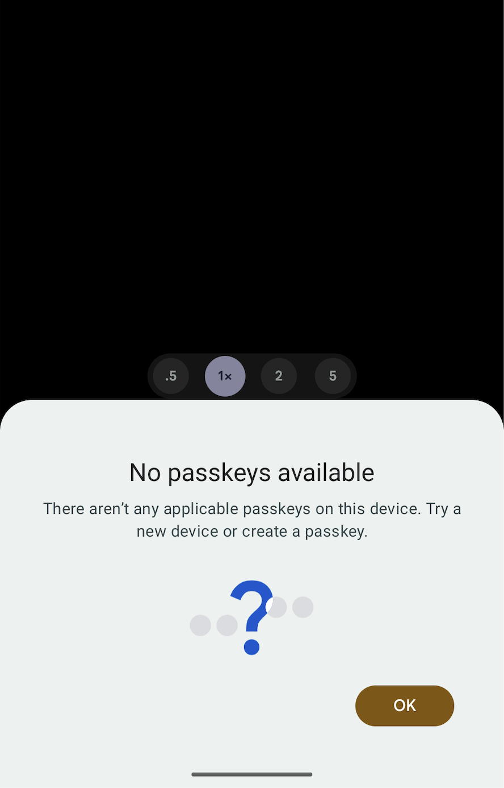

# Explainer: Cross-Device Fallback URL

## **Authors**

Harsh Lal \<[harshlal@google.com](mailto:harshlal@google.com)\>  
Tim Cappalli \<[tim.cappalli@okta.com](mailto:tim.cappalli@okta.com)\>

*Last updated: 2026-02-26*

## Summary

This proposal introduces the crossDeviceFallbackUrl extension for WebAuthn get assertion requests, which use FIDO Cross-Device Authentication (currently known as FIDO CTAP hybrid transports).  
It allows WebAuthn Relying Parties (RPs) to provide a “backup” URL to a sign in page, which an authenticator device (for example, a phone) can open if no passkey is found after processing the cross-device request (e.g. scanning the QR code or selecting a linked device). The mechanism reduces friction in passwordless adoption by preventing dead-end sign-in attempts.

## Background & Motivation

After around 4 years of passkeys in the market, one of the top failures observed in cross-device authentication requests is “Credential Not Found”. This occurs when a passkey cannot be found in credential managers on the remote device, after the user has gone through significant friction to interact with a second device.

This failure introduces friction into the passkey sign-in experience and reduces overall sign-in success rate for Relying Parties. Some metrics show that a substantial fraction (for example, \~32%) of authenticator failures are due to missing credentials on the device.

### The Current Experience

When a user scans a QR code or selects a linked device, but has no passkey on that phone or tablet, the flow typically fails with a generic “passkey not found” message, leaving the user frustrated, without a clear recovery path

<div align="center">
  
</div>

## Goals

* Eliminate the dead-end for users by allowing a WebAuthn Relying Party to provide a fallback URL which can be opened in a default browser or associated native app.

## Non-Goals

* Allow a WebAuthn Relying Party to provide a fallback URL for create credential requests  
* Specify how session state is passed in the fallback URL

## Proposed Solution: the crossDeviceFallbackUrl extension

This client and authenticator extension allows a Relying Party to include a fallback URL, which can be used by the remote device in the event there is no passkey available in a credential manager.

The rough WebIDL definition is:

```idl  
// extension identifier: crossDeviceFallbackUrl

partial dictionary AuthenticationExtensionsClientInputs {  
  DOMString crossDeviceFallbackUrl;  
};

// Used by the JSON helper methods  
partial dictionary AuthenticationExtensionsClientInputsJSON {  
  DOMString crossDeviceFallbackUrl;  
};

partial dictionary AuthenticationExtensionsClientOutputs {  
  // to be determined, see questions below  
};

// Used by the JSON helper methods  
partial dictionary AuthenticationExtensionsClientOutputsJSON {  
  // to be determined, see questions below  
};  
```

Sample get assertion request using the extension:

```js  
const options = {  
  challenge: "J3sCQNy4FANcC9plxO3xm0vrJ9CU3sURZjdNLg8QxW2lKCahZkTXKV1LtP7RMlObiuGLBxnBtg5YzH1et3pnYw",  
  timeout: 60000,  
  rpId: "login.example.com",  
  userVerification: "preferred",  
  extensions: {  
      crossDeviceFallbackUrl: "https://login.example.com/methods/passkey/fallback/?sessionId=G4yKzAsSuqQfsw96AO5K4oB7udA4qgW9"    
    }  
}

const assertion = await navigator.credentials.get({ "publicKey": options });  
```

### Responsibilities

#### WebAuthn Client

1. Verifying the fallback URL is well formed  
2. Verifying the fallback URL’s origin matches the RP ID, using existing WebAuthn validation logic  
3. Stripping the fallback URL from requests before passing them to credential managers

#### Remote Device Client Platform

1. Platform service invocation of the URL  
2. Stripping the fallback URL prior to passing the request to credential managers

### 

### User Visible Experience / Behavior

1. The user clicks a “Sign in with a passkey” button or selects the “Use another device” option from autofill UI  
2. The user is shown a QR code and/or a linked device selection screen  
3. The user uses the camera app on their phone or tablet to scan the QR code -or- clicks the linked device of their choosing  
4. On the remote device  
   1. QR code: the client platform shows a dialog  
   2. Linked device: the user taps the notification, and the client platform shows a dialog  
5. No passkey was found in the user’s credential manager(s), so they’re asked if they want to sign in without a passkey. The user taps yes.  
6. The remote client platform invokes the URL at the platform level (platform specific) and launches either the user’s default browser, or the site’s native app if installed.  
7. The user interacts with the site/app to sign in using an alternative authentication method.

### WebAuthn Client, Local Client Platform, and Remote Client Platform Behavior

1. The WebAuthn Client receives the WebAuthn get assertion request from the Relying Party  
2. The WebAuthn Client passes the request to the Client Platform\*  
3. The Client Platform strips out the fallback URL, and passes the request to enabled credential managers.  
4. If a credential is:  
   1. Found, continue with normal credential selection; end this process  
   2. Not Found, proceed to next step  
5. The Client Platform\* crafts a cross-device authentication request using CTAP hybrid transports, and invokes the user visible elements  
6. Once the user scans the QR code or taps their linked device, the protocol kicks off and establishes the necessary communication channels  
7. The remote Client Platform strips out the fallback URL, and then passes the request to enable credential managers  
8. If a credential is:  
   1. Found, continue with normal credential selection; end this process  
   2. Not Found, proceed to next step  
9. The remote Client Platform displays a dialog, and waits for user interaction  
10. If:  
    1. The user dismisses the dialog, abort the request; end this process  
    2. Taps the button to invoke the fallback URL (text / styling is platform specific), proceed to next step  
11. The remote Client Platform passes the fallback URL to a platform-specific API for invocation  
12. The platform processes the URL and either invokes an associated native app or the device’s default browser  
13. The remote Client Platform returns a response\*\* over CTAP  
14. The local Client Platform returns the response\*\* to the WebAuthn Client  
15. The WebAuthn Client resolves the promise, returning the response\*\* to the Relying Party

\* Some WebAuthn Clients also handle Client Platform capabilities and vice versa.  
\*\* what that response looks like, is still an open question. See below

### Open Architectural/Design Questions

1. Should the API always accept the extension or should it error out for scenarios which aren’t allowed (e.g. if the extension is included in a create request, or in a platform attachment request)?  
2. If the URL is not valid, should the WebAuthn Client abort the request or not pass the extension?  
3. Should we provide more guidance for using this in combination with OAuth 2.0 Device Code flow, which will be common for constrained devices such as smart TVs?

## Usability Considerations

This extension is primarily a usability optimization designed to "bridge the gap" for users who are new to passkeys or switching devices.

* Seamless recovery: Users confused by a “passkey not found” message can be taken to a familiar web login on their phone, which most users understand and trust.  
* Device suitability: This is especially useful for constrained clients (for example, Smart TVs or game consoles) where entering credentials is awkward. Moving the recovery interaction to the phone improves usability.  
* Adoption incentive: RPs may be more comfortable offering passkey-first experiences if there is a reliable fallback path, reducing the risk of locking out users who lack a passkey on the local device.

## Security & Privacy Considerations

There are two specific abuse vectors for this capability, which are mitigated with the restrictions described in this section.

**Open Redirector**: Browsers and platforms do not want their native UI to become an "Open Redirect" service. A malicious RP could use the authenticator UI to bounce users to malware downloads or affiliate spam.

**Privacy Leakage (Tracker Injection)**: An RP could set the fallback URL to a third-party ad-tech or analytics domain to force a cross-site tracking event when the user clicks the link.

### URL Restrictions

To prevent the abuse vectors described above, the fallback URL is required to match the RP ID using the same effective domain suffix logic as the WebAuthn request itself. This processing happens on the WebAuthn Client prior to passing the request to the remote device via CTAP.

Below are some examples of valid and invalid combinations:

| RP ID | Fallback URL  | RP ID Well-Known (ROR) | Valid? |
| :---- | :---- | :---- | :---- |
| `login.example.com` | `https://login.example.com/blah` | none | **Yes**, exact match |
| `example.com` | `https://login.example.com/blah` | none | **Yes**, same effective domain |
| `shopping.com` | `https://shopping.ca/blah` | none | **No**, different effective domain |
| `shopping.com` | `https://sh0pping.com/blah` | none | **No**, different effective domain |
| `shopping.com` | `https://shopping.ca/blah` | Yes, includes: `https://shopping.ca` | **Yes**, Related Origin Requests |

Another requirement is that the fallback URL is not shared with authenticators/credential managers. It is only processed by the WebAuthn and Client Platform (local and remote).

### Probing

This extension aims to streamline the user experience when a passkey is unavailable on either the local or remote device. A potential concern is "probing", where an RP might attempt to silently detect if a user possesses a credential. However, the architecture of the FIDO2/WebAuthn cross-device flow renders silent probing impossible, as it strictly enforces user interaction at multiple stages.

Consequently, the use of a fallback URL presents no greater privacy risk than current methods, such as local redirects or magic link-based recovery flows, which also signal credential absence to the RP.

### Privacy Related Open Questions

1. What should be the response back to the Relying Party?  
2. Should we explicitly require the remote client platform to not follow redirects during invocation?  
3. Should user interaction (e.g. a button click) be required on the remote device before invoking the URL?

## Stakeholder Interest

**RP Developers**: This capability was inspired by feedback from WebAuthn Relying Parties.

**Client Vendors**: Two WebAuthn Clients and 2 client platforms have expressed interest in implementing this capability.

## Dependencies

This capability also requires updates to the FIDO Client to Authenticator Protocol.

## Alternatives Considered

### Static "Well-Known" Fallback

Instead of sending a specific URL, the device could automatically go to a standardized endpoint (e.g., [/.well-known/passkey-endpoints](https://www.w3.org/TR/passkey-endpoints/)). However, this method lacks the ability to pass important session context (state), requiring the user to manually re-enter usernames, codes, or other credentials, impacting usability.

### Embedding the URL in the cross-device invocation QR code

An alternative approach could be for the Client Platform to embed the URL in the cross-device invocation QR code itself. This pattern would still require the extension, as the URL needs to be given to the WebAuthn Client by the Relying Party.

This pattern has three downsides:

1. It increases the size of the QR code, making it more difficult to scan  
2. It can cause issues with older remote clients who don’t know how to, or can’t handle the URL  
3. It would not support linked devices (which don’t use a QR code)
